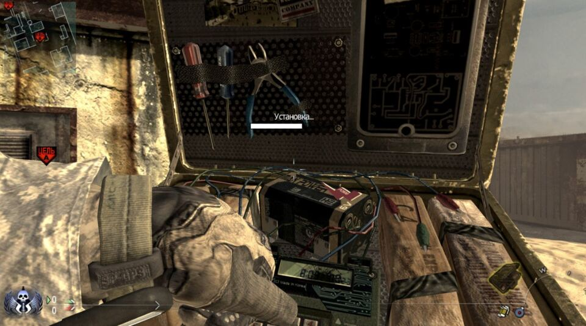
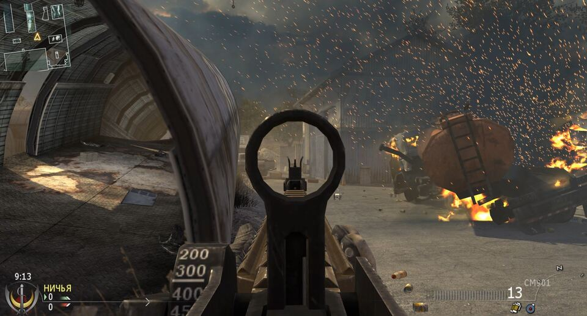
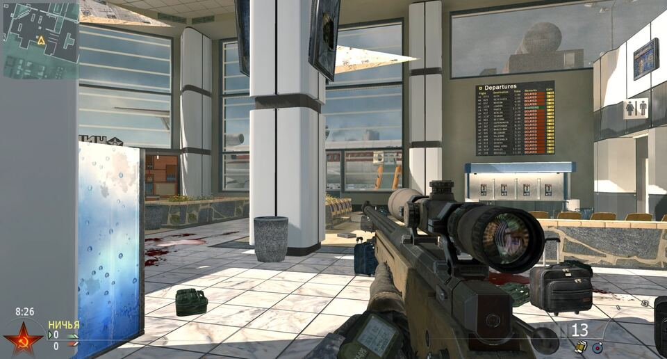
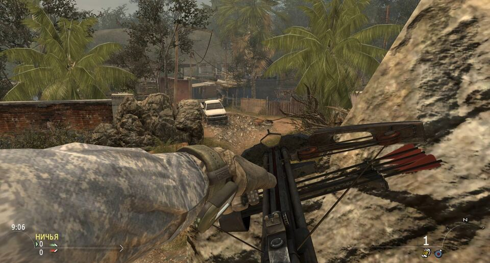
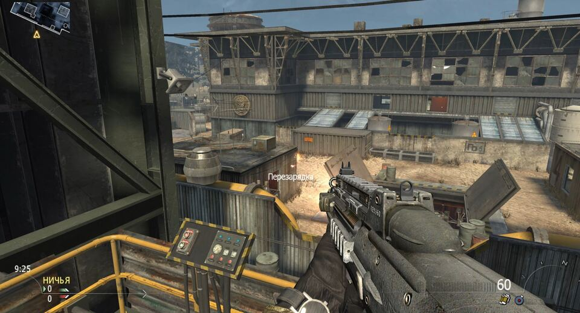
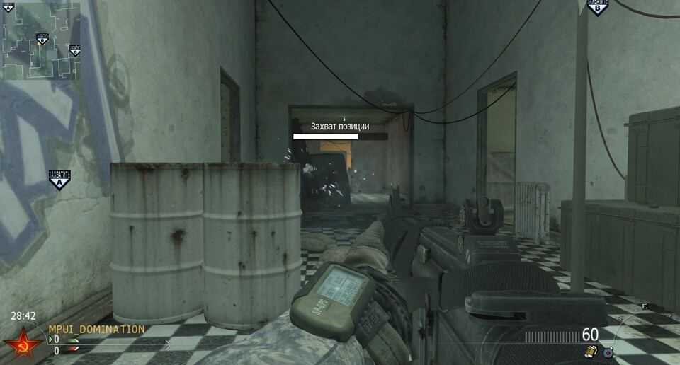

# IW4L

<p align="center">
  
  
</p>

IW4L is a Call of Duty runtime written from scratch in Rust, on
[bevy](https://bevyengine.org/) and [wgpu](https://wgpu.rs/). Point it at a copy
of MW2 you already own and it loads that install's data into its own engine.

The on-disk layouts came out of reverse engineering the original binaries and
reading public technical references.

This whole project is written by an LLM.

## Architecture

| | |
|---|---|
| assets | MW2 zones read natively; MW3 and Black Ops land in the same `asset_iw4` IR. One pipeline, three games. |
| shaders | Retail D3D9 SM3 tokens translated to WGSL. No DirectX at runtime. |
| rendering | One sorted drawsurf list; only the tess emitters fork per surface type. |
| physics | Fixed 17 ms step on its own accumulator. Framerate changes nothing about how a body falls. |
| simulation | One `TickInput → sim::step → Snapshot` funnel for server, prediction, replay and the determinism test. |
| network | Custom p2p wire over UDP: deltas, reliability, reconciliation. A QUIC master only introduces peers. |
| platforms | Linux and a portable Windows build. |

Retail protocols, the original ABI and patched executables are out of scope.
IW4L clients talk to IW4L clients.

<p align="center">
  
  
</p>

## Game data

`IW4L_GAMES` points at the folder holding your game trees. No assets ship in
this repository or in any release, and IW4L is unaffiliated with the rights
holders of the original games.

Those trees are read only. IW4L never patches them, swaps files in them or
writes anything back; caches, settings, demos and logs land in
`iw4l-artifacts/` next to the IW4L binary.

## Build and run

```bash
cp .env.example .env          # IW4L_GAMES — folder containing the game trees
make map mp_boneyard          # run a map
make map mp_boneyard CMDS='spawn assault; wait 2s; quit'
make help                     # every recipe
```

Live runs use `[profile.play]`, a development build with optimizations turned
on. `PROFILE=release` builds the real release binary.
[`docs/WINDOWS.md`](docs/WINDOWS.md) covers Windows.

## Releases, network and updates

Builds go out as pre-releases: `v0.1.0-demo.N`, "IW4L Technical Demo N". Each
one names the commit it came from, the platforms it was run on, the demo
scenario and its known limitations, and carries `LICENSE`, `NOTICE` and the
bundled font licences. A platform reaches that list once a build for it has
been run; compiling doesn't earn a mention.

* Nothing here is stable yet. The API, the config format, caches and the wire
  protocol all change between builds, so play a session on one release. Expect
  bugs and desyncs.
* The network side is for arranged playtests among people who already agreed
  to play. It has never been vetted for lobbies full of strangers.
* Releases never update themselves. A release archive runs as it shipped, and
  replacing it is your move.
* IW4L sends nothing home. Diagnostic files sit on your disk until you attach
  them to a report.
* The demo master is one machine with no uptime promise. Local play never
  touches it; [`docs/MASTER.md`](docs/MASTER.md) covers what it logs and how to
  run your own.

Security reports go to [`SECURITY.md`](SECURITY.md).

## Documentation

Implementation notes live under `docs/`, one short file per area. Start at
[`docs/INDEX.md`](docs/INDEX.md).

| file | about |
| ---- | ----- |
| [`docs/RUN.md`](docs/RUN.md)           | running the game, console scripts, commands and traps |
| [`docs/PERF.md`](docs/PERF.md)         | Perfetto tracing and performance analysis             |
| [`docs/RENDER.md`](docs/RENDER.md)     | rendering pipeline                                    |
| [`docs/MAP-LOAD.md`](docs/MAP-LOAD.md) | map loading and asset installation                    |
| [`docs/ENTITIES.md`](docs/ENTITIES.md) | simulation data flow and entity taxonomy              |
| [`docs/SIM-STEP.md`](docs/SIM-STEP.md) | simulation step architecture                          |
| [`docs/ANIM.md`](docs/ANIM.md)         | animation system                                      |
| [`docs/WINDOWS.md`](docs/WINDOWS.md)   | portable Windows build                                |
| [`docs/DEPLOY.md`](docs/DEPLOY.md)     | release, publishing and deployment                    |
| [`docs/MASTER.md`](docs/MASTER.md)     | running your own master server                        |

## Contributing and support

A personal, experimental project. Bug reports are welcome and get no promised
fix date. [`CONTRIBUTING.md`](CONTRIBUTING.md) says what a useful report
contains and how changes get reviewed.

## Acknowledgements

IW4L ships none of the code below. It was read against all of it.

* [OpenAssetTools](https://github.com/Laupetin/OpenAssetTools) and its
  [iw4x-x64 fork](https://github.com/iw4x-x64/oat) — modding tools whose
  asset-structure headers document the on-disk layouts IW4L reads.
* [IW4x](https://github.com/iw4x/iw4x-client) — a custom client for MW2 (2009),
  a cross-reference for asset and protocol behaviour.
* [KisakCOD](https://github.com/SwagSoftware/KisakCOD) — an open-source CoD4
  reimplementation, a cross-reference for engine structure one generation over
  in the same family.
* [Ghidra](https://github.com/NationalSecurityAgency/ghidra) — the framework the
  original binaries were read with.

<p align="center">
  
  
</p>

## License

IW4L is licensed under the [Apache License 2.0](LICENSE), and
[`NOTICE`](NOTICE) holds the copyright notices, the licences of the projects
above and the bundled fonts. That licence covers IW4L's own source code. Call of Duty, Modern Warfare, Black Ops and the
related assets, trademarks and intellectual property belong to their respective
owners.
