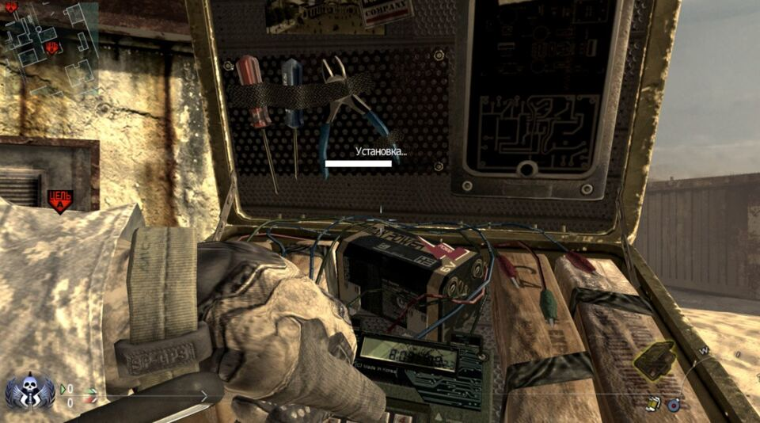
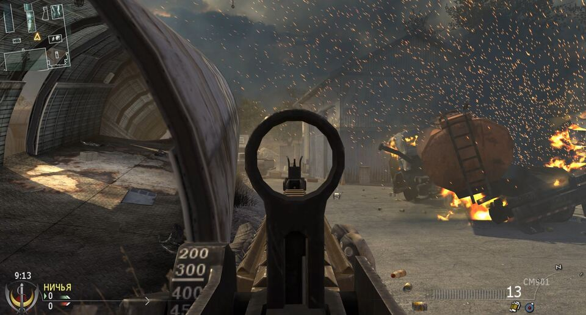

# IW4L

IW4L is an open-source runtime for Call of Duty: Modern Warfare 2 (2009), written in
Rust with [Bevy](https://bevy.org/). Point it at a copy of MW2 you already own and it
loads that installation's maps, models, textures and weapons into its own engine. You
can try implemented movement and combat on multiplayer maps, then inspect or change how
those systems work.

<p align="center">
  
  
</p>

## What you can try

Explore maps, fight bots, and record and replay demos. Gameplay remains incomplete;
expect missing behavior, bugs and desyncs. The asset readers also cover MW3 and Black
Ops.

APIs, configuration, caches and the wire protocol change between commits;
multiplayer peers must run the same build.

## Windows: prebuilt release

1. Download `iw4l-windows.zip` from [Releases](../../releases) and extract it into an
   empty writable folder. The archive password is `t.me/contextrot`.
2. Launch `iw4l.exe`. It finds MW2 in your Steam libraries and creates a
   `Modern Warfare 2.lnk` shortcut next to itself. For an install outside Steam, create
   that shortcut to your MW2 folder yourself.

For online play, put the `.iw4l-server` file you received from a server operator next
to `iw4l.exe`. With it the game finds that master and updates itself on launch. Details:
[Windows guide](docs/WINDOWS.md).

## Build and run

Install Rust through rustup and GNU Make. [Build dependencies](docs/BUILD.md) cover
Linux's C/C++ toolchain and system libraries, and macOS's Xcode command line tools.
[Windows instructions](docs/WINDOWS.md) cover building and arranging a portable folder.

You need your own installed MW2 Multiplayer data. IW4L
distributes no game assets and reads installations without patching or replacing their
files. Caches, demos and logs go under `iw4l-artifacts/`; Linux settings use a separate
configuration directory described in the [run guide](docs/RUN.md).

From the repository root:

```bash
cp .env.example .env
# Edit .env: set IW4L_GAMES to the folder containing your game installations.
make map mp_boneyard CMDS='wait world; spawn 0; force_match_start; bot add 3'
```

This builds the optimized `play` profile and starts a local match with three bots.
`force_match_start` skips the warmup that otherwise freezes movement.

Just checking whether it runs on your PC? A debug map is included for that:
`make map ZONE=iw4l:field` needs no game files, only an empty `IW4L_GAMES` folder.

## Inside the engine

| Area | Implementation |
|---|---|
| Assets | Native FastFile readers convert game data into a shared intermediate representation. |
| Shaders | Retail Direct3D 9 Shader Model 3 bytecode is translated to WGSL. |
| Rendering | World geometry, models and effects feed one sorted draw-surface list. |
| Simulation | Server authority, client prediction and replay share one simulation step over explicit Bevy ECS state. |
| Networking | Custom UDP traffic; a QUIC master provides browsing and relaying. The host simulates the match. |

## Where to go next

- [Run guide](docs/RUN.md): console commands, classes and demo playback; [master setup](docs/MASTER.md) for playtests.
- [Rendering](docs/RENDER.md) and [simulation](docs/SIM-STEP.md): inspect the engine's implementation.
- [Map loading](docs/MAP-LOAD.md), [GSC runtime](docs/GSC-RUNTIME.md) and [bot AI](docs/BOTS.md): starting points for experiments and modifications.
- [Documentation index](docs/INDEX.md), [contributing](CONTRIBUTING.md) and [security reports](SECURITY.md).

This whole project is written by an LLM.

## Acknowledgements and license

[OpenAssetTools](https://github.com/Laupetin/OpenAssetTools) and its [iw4x-x64
fork](https://github.com/iw4x-x64/oat) informed asset layouts;
[IW4x](https://github.com/iw4x/iw4x-client) informed asset and protocol behavior;
[KisakCOD](https://github.com/SwagSoftware/KisakCOD) informed engine structure.
[Ghidra](https://github.com/NationalSecurityAgency/ghidra) was used to inspect the
original binaries.

IW4L's source is licensed under [Apache 2.0](LICENSE). Preserve required attribution and
bundled font license texts when redistributing; see [NOTICE](NOTICE). Original game
assets and trademarks belong to their owners. IW4L is unaffiliated with them.
